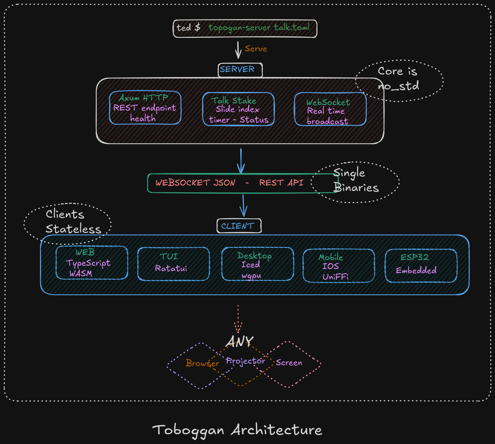
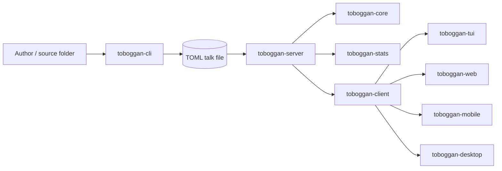

# Architecture

Toboggan is a Rust workspace built around a shared core model, a stateful server, and multiple thin clients.

## Workspace shape

| Crate | Role |
|-------|------|
| `toboggan-core` | Shared domain model: talks, slides, commands, notifications, timestamps, durations |
| `toboggan-server` | Axum server, presentation state owner, WebSocket broadcast hub |
| `toboggan-cli` | Folder-to-presentation converter and statistics reporter |
| `toboggan-client` | Async client helpers for HTTP + WebSocket connections |
| `toboggan-tui` | Terminal presenter/client based on `ratatui` |
| `toboggan-web` | Browser UI built with TypeScript and Vite |
| `toboggan-mobile` | UniFFI bindings for Swift and Kotlin consumers |
| `toboggan-stats` | Word counts, duration estimates, and presentation metrics |
| `toboggan-desktop` | Separate iced/wgpu desktop app workspace |

## How the pieces fit together

## Runtime responsibilities

- `toboggan-core` owns the shape of the data and protocol messages.
- `toboggan-cli` turns a source folder into a serialized talk and prints useful statistics.
- `toboggan-server` loads the talk, validates config, serves HTTP endpoints, and broadcasts WebSocket notifications.
- `toboggan-client` handles connection setup, retries, and protocol messages shared by several frontends.
- `toboggan-stats` computes duration estimates and word counts from the parsed talk.
- `toboggan-web`, `toboggan-tui`, `toboggan-mobile`, and `toboggan-desktop` are presentation clients that mostly render state and send commands.

## Protocol shape

The protocol is JSON over WebSocket and uses the shared enums from `toboggan-core`:

- Client commands: `Register`, `Unregister`, `Ping`, `First`, `Last`, `GoTo`, `NextSlide`, `PreviousSlide`, `NextStep`, `PreviousStep`, `Blink`
- Server notifications: `State`, `Error`, `Pong`, `Blink`, `TalkChange`, `Registered`, `ClientConnected`, `ClientDisconnected`

## Why the workspace is split

- The core/server/cli/client crates stay relatively light and compile quickly.
- Desktop is isolated in a separate workspace because `iced` and `wgpu` significantly increase compile time and memory usage.
- Web, mobile, and terminal clients can all reuse the same core protocol and data model.
