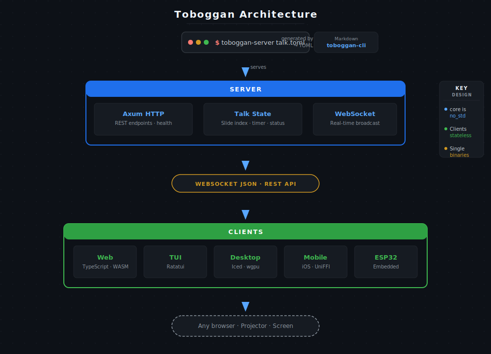

# Architecture

Toboggan is organized as a Rust workspace with multiple crates:



| Crate | Role |
|-------|------|
| `toboggan-core` | Core types & `no_std` logic |
| `toboggan-server` | Axum WebSocket server (talk state owner) |
| `toboggan-cli` | Markdown → TOML conversion |
| `toboggan-client` | Shared WebSocket client library |
| `toboggan-tui` | Terminal UI (Ratatui) |
| `toboggan-web` | Web frontend (TypeScript + WASM) |
| `toboggan-desktop` | Desktop app (Iced + wgpu, separate workspace) |
| `toboggan-mobile` | iOS bindings (UniFFI) |
| `toboggan-stats` | Presentation statistics |
| `toboggan-esp32` | ESP32 embedded client |

## Key design decisions

- **`toboggan-core`** is `no_std` compatible, usable from embedded devices
- **Server** owns the talk state and broadcasts changes to all clients
- **Clients** are stateless — they display what the server sends
- **Protocol** is WebSocket for real-time, REST for batch operations
- **Desktop** is a separate workspace to reduce build RAM usage

## Protocol

The WebSocket protocol uses JSON messages:

```json
// Server → Client
{ "type": "state", "state": { "current": 0, "total": 10 } }
{ "type": "slide", "index": 0, "content": { "title": "...", "body": "..." } }

// Client → Server
{ "type": "command", "command": "NextSlide" }
{ "type": "ping" }

// Server → Client
{ "type": "pong" }
{ "type": "error", "message": "..." }
```
